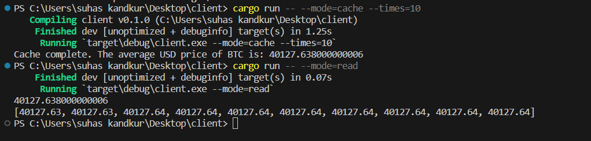
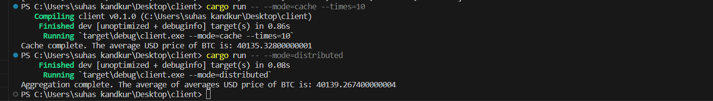
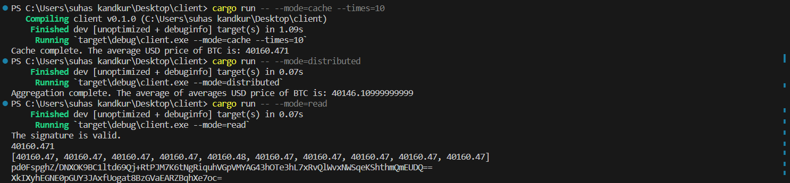

# Assignment
This assignment involves a multi-step process to fetch, aggregate, and verify data. The source code is divided into three parts: `step-1.rs`, `step-2.rs`, and `main.rs` (final step).


## Step 1

The first step involves fetching real-time Bitcoin (BTC) to US Dollar (USD) trade prices from a WebSocket server. It calculates the average price from the fetched data and prints the result:

```plaintext
Cache complete. The average USD price of BTC is: XXX
![running step-1.rs]

Both the average price and the individual data points used to calculate it are saved to a file named data.txt. After saving the data, it reads the file and prints the contents.

Here’s an example of running step-1.rs:


## Step 2
The second step involves instantiating five client processes and one aggregator process. Each client fetches data and calculates an average price, and the aggregator calculates the average of these averages, resulting in another average value.

Here’s an example of running step-2.rs:


## Step 3
The final step involves reading the average price and a signature from the data.txt file. It verifies the signature using a provided public key. If the signature is valid, it prints:

The signature is valid.

If the signature is not valid, it prints:

The signature is not valid.

Here’s an example of running main.rs:
